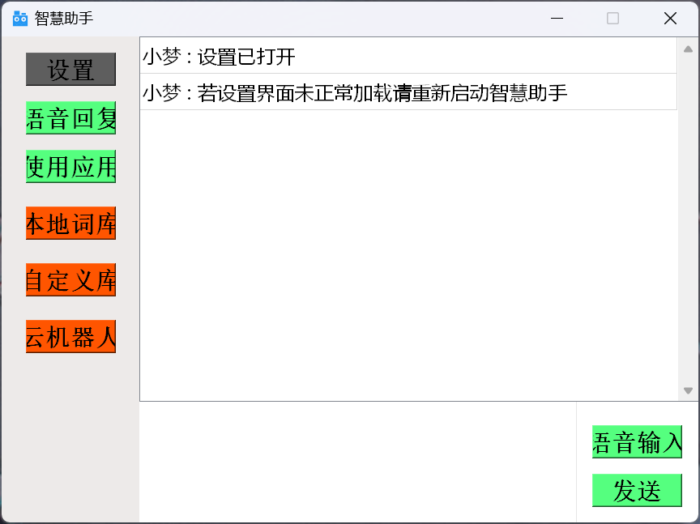
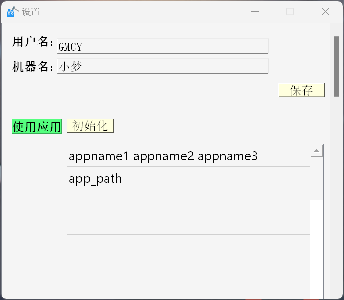

# 智慧助手

## 1. 基本信息

- 作者: GMCY
- 系列: 未分类
- 仓库: [GitHub](https://github.com/GMCY2020/Clever-Ai) | [Gitee](https://gitee.com/GMCY2020/Clever-Ai)
- 话题(GitHub): [python](https://github.com/topics/python) \ [pyqt5](https://github.com/topics/pyqt5) \ [ai](https://github.com/topics/ai) \ [robot](https://github.com/topics/robot) 
- 创建时间: 2021/2/10

## 2. 介绍

- 用 `Python` 写的一个聊天机器人 (感觉好像没什么用~)
- 个人学习自用
- 若想使用该项目全部功能，请自行补全 `百度语音识别api` 和 `图灵机器人api`
- Bug
  - win11可能不太适配
  - win10应该可以用吧，应该吧~
  - win11下多个屏幕下pyautogui无法正常匹配图片坐标
  - 所以相关的功能只能在单个屏幕下
  - 删除旧的坐标匹配图片, 重新截图, 才能正常使用, 否则直接跳出功能
- 代码应该有亿点冗杂，3年前写的(ノへ￣、)，最近才整理~

- 功能：
  - 聊天
  - 连接图林云机器人
  - 自定义回复
  - 语音识别
  - 电脑应用的使用

  
- 1.使用智慧助手时会先开启一个黑屏终端
  - 这是用来监视智慧助手打开的其他电脑应用
  - 关闭黑屏终端会同时把与智慧助手相关的应用都关闭

- 2.语音识别功能
  - 依赖百度语音识别
  - 所有如果语音识别功能失效的话，应该是请求次数到10000的上限了
  - 增加次数要钱，so。。。。。。

- 3.云机器人
  - 接的是图林机器人，刚exe安装智慧助手默认共用一个url（有限制）
  - 若要使用自己的url可以到设置下修改
  - 图林机器人官网：http://www.turingapi.com/

- 4.1.电脑应用信息注意事项
  - 刚安装智慧助手时无法正常使用电脑应用功能
  - 要自行到设置下的应用功能专栏下加载电脑应用的信息
  - 格式为如下：
  - 第一行：应用的名字叫法1 应用的名字叫法2 应用的名字叫法3 ...（应用的名字叫法1一定是应用的默认英文名字，不然在使用应用关闭会出错）
  - 第二行：应用的绝对地址（可以在桌面右键应用的属性下复制）

- 4.2.电脑应用使用的关键词有如下
  - 打开应用：打开、开、登录一下、登陆一下、登录、登陆、登、使用、用、听一下、听、想
  - 关闭应用：关闭、关、退一下、退出、退、结束
  - 搜索：搜索、搜索一下、查找一下、查找、查、找、搜、翻译一下、翻译下、翻译
  - 正常化：正常化、正常
  - 迷你化：迷你化、迷你、最小化
  - 下一首音乐：下一首、下首、另一首
  - 上一首音乐：上一首、上首
  - 播放音乐：播放、播、放
  - 暂停音乐：暂停、停、停止

- 4.3.电脑应用图片注意事项
  - 要正常调用该截图功能需要电脑的截图快捷键为shift+win+s
  - 刚安装智慧助手时无法正常使用该功能，要先加载应用信息后，再要使用相应功能时会提示截取相应的图片
  - 如果使用时匹配较久，请到应用目录下的Png把相应的图片自行替换，匹配速度取决于截取的图片和电脑配置

- 5.特殊指令
  - 清空屏幕		会把当前的聊天记录清空
  - 打开设置		把设置打开
  - 关闭设置		把设置关闭
  - 关闭智慧助手	把智慧助手关闭了
  - 打开应用信息	打开存储应用信息的txt文件
  - 打开自定义词库	打开存储自定义词库的txt文件
  - 打开历史记录	打开存储所有电脑应用信息的txt文件

- 慎修改txt文件，若自行修改后出错请解压应用目录下的Messages的备份.zip进行覆盖，覆盖前请自行保存先前加载的信息

## 3. 环境

编辑器
- `PyCharm`

语言
- `Python 3.7.9`

库
- `baidu_aip`
- `Pillow`
- `PyAutoGUI`
- `PyQt5`
- `pywin32`
- `Requests`
- `SpeechRecognition`
- `等`

## 4. 使用

- 下载 `releases/Clever_Ai_D_Setup.exe` 安装使用
- 建议这种使用，bug可能少点~

或者

- 安装依赖 `requirements.txt`
- `PyAudio` 安装不了 使用 `pip` 安装 `docs/PyAudio~.whl`
- 运行 `Main/Clever_Ai.py`
- 可能大概率有 bug ~ ~

## 5. 效果图

主界面

设置
